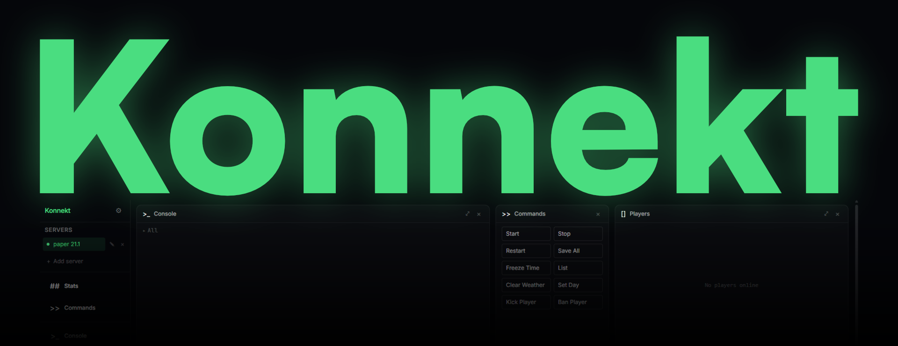

# Konnekt
(Alpha)

[](https://github.com/kollektiv-mc/Konnekt/actions/workflows/ci.yml)
[](https://github.com/kollektiv-mc/Konnekt/actions/workflows/codeql.yml)
[](#verifying-a-download)
[](https://github.com/kollektiv-mc/Konnekt/releases)
[](#platform-support)
[](go.mod)
[](LICENSE)

<!--
  Every badge above links to the thing it claims, so a reader can check it
  rather than take it. CI and CodeQL are served by GitHub for this repository
  and nobody else can publish to those URLs; Release, Go and License are read
  live from this repository's releases, go.mod and LICENSE. The two static ones
  restate something documented further down and link to it.

  Deliberately absent: downloads, stars, and any score this project gives
  itself. A number a project awards its own code says nothing to someone who
  has not read the code, which is the whole problem a badge is supposed to
  solve.

  To add once its first run has been read (.github/workflows/scorecard.yml):
  [](https://scorecard.dev/viewer/?uri=github.com/kollektiv-mc/Konnekt)
-->

## About

Konnekt is a cross-platform desktop control panel for self-hosted Minecraft servers. It wraps everything you'd normally do through a raw console, RCON, or SSH — starting servers, watching logs, managing worlds, scheduling backups, installing mods — into a single native app with a modular, drag-and-drop dashboard.

It's built for Minecraft server admins and hobbyists who self-host vanilla, Paper/Spigot/Bukkit, or modded Fabric/Forge servers and want a real GUI instead of stitching together terminal windows and plugins.

> **Status:** Alpha. Core management, scheduling, worlds, backups, and mods are functional; see [Roadmap](#roadmap) for what's still coming.

## Features

### Multi-server management (Alpha)

Add and configure any number of server instances — jar path, JVM arguments, working directory — and start, stop, or restart them independently, with a guided EULA acceptance flow for first-time setup.

### Live console

Stream server logs in real time, send commands directly, and set up your own quick-command buttons for the actions you run most.


### Stats & performance

Keep an eye on TPS, RAM usage, player count, and uptime at a glance, with a rolling performance history chart to spot trends and troubleshoot lag.

### Player management

See who's online and kick, ban, or pardon players without leaving the dashboard.

### Visual scheduler

A node-based automation editor: wire up triggers (a player joining or leaving, the server stopping, TPS dropping below a threshold, a cron/interval/time-of-day schedule) to actions (run a console command, send an RCON command, trigger a backup, make an HTTP request, wait, start/stop/restart the server) and control/data blocks (conditions, math, randomness, server attributes). Runs are tracked with history and next-run predictions.


### World management

A 3D visualizer for navigating your server's worlds and dimensions — switch the active world, rename, duplicate, delete, back up individual worlds, and inspect NBT metadata.


### Backups

Manual or scheduled backups of full servers or individual worlds, with safe restore (validated paths, extract-then-swap), progress feedback, and history.


### Server config editor

Browse and edit `server.properties` and other config files (JSON/YAML/TOML) through a form view or raw text editor.


### Mods & plugins

Browse and search Modrinth from inside the app, resolve dependencies, install or uninstall, enable/disable, check for updates, or install a local jar. Konnekt detects your server's loader (Fabric, Forge, Paper, etc.) automatically.


### Customizable tile dashboard

Every feature lives in a draggable, resizable tile that snaps to a grid. Stash tiles you're not using in the crate, maximize the ones you need, and save named layout presets.


### Notifications

An in-app notification feed plus native OS desktop notifications for crashes, joins/leaves, backup completion, TPS drops, and scheduler events.

## Compatibility

Konnekt integrates with popular server mods and plugins to extend its core features. Click a mod to see feature-level detail.

### Compatible

<details>
<summary> <strong>Multiverse</strong></summary>

- Multi-World & Dimension management

</details>

### Planned

<details>
<summary> <strong>Multiverse</strong></summary>

- Visual world connections
- In-world portal & sign management

</details>

<details>
<summary> <strong>BlueMap</strong></summary>

- Map viewer integration

</details>

<details>
<summary> <strong>WorldGuard</strong></summary>

- Region protection integration

</details>

## Why Konnekt

- **Local-first.** All app state is stored locally on disk — no account, no cloud dependency, no telemetry required to run your server.
- **Cross-platform.** Built on [Wails](https://wails.io/); tagged releases ship a Windows build, the rolling snapshot channel adds Linux and an `.rpm` (see [Platform support](#platform-support)), and it also runs as a native app on macOS from source.
- **One dashboard, not ten tools.** Console, stats, scheduling, worlds, backups, config, and mods all live in the same window instead of separate scripts and plugins.

## Tech stack

- **Backend:** Go, via [Wails v2](https://wails.io/) for native windowing and Go↔JS bindings
- **Frontend:** React 19, TypeScript, Vite, Tailwind CSS v4
- **State:** Zustand
- **Visual scheduler:** [React Flow](https://reactflow.dev/) on the frontend, a graph execution engine in Go on the backend
- **World visualizer:** three.js / @react-three/fiber
- **Config editing:** CodeMirror

## Platform support

Prebuilt binaries come from two channels: tagged releases, and the rolling
`snapshot` prerelease rebuilt from `main`. Both are on the
[releases page](https://github.com/kollektiv-mc/Konnekt/releases); the snapshot
is a prerelease, so GitHub keeps it out of the default view.

Both channels update in place from inside the app. Stable is the default;
Settings > General switches to snapshots, and a snapshot build follows that
channel on its own. Installing a snapshot warns first, because it is untested
nightly code.

- **Windows** (`konnekt-windows-amd64.exe`) — tagged releases and snapshots.
- **Linux** (`konnekt-linux-amd64`, plus an `.rpm` for Rocky/RHEL 10 and
  Fedora) — **snapshots only so far.** The release workflow builds both, but
  those jobs landed after the one tagged release was cut, so the next tag is
  the first to carry them. They are built against webkit2gtk-4.1, which covers
  Rocky/RHEL 10, Fedora 36+, Ubuntu 22.04+, and Debian 12+. **Rocky/RHEL 9 is
  not supported**: EL9 never received webkit2gtk-4.1, and EL10 dropped
  webkit2gtk-4.0, so the two are not binary-compatible.
- **macOS** is not published on either channel, but builds from source via
  `wails build` like any other platform.

### Verifying a download

The binaries carry no code-signing certificate, so Windows SmartScreen warns on
first launch. That warning is about a certificate this project does not buy, not
about where the file came from, and there is a better answer to the second
question than clicking through.

Every artifact on both channels is built by GitHub Actions and carries a signed
build provenance attestation: its digest is bound to this repository, this
workflow and the exact commit it was built from, signed with a short-lived
[Sigstore](https://www.sigstore.dev/) certificate and recorded in a public
transparency log. To check one, with the [GitHub CLI](https://cli.github.com/):

```bash
gh attestation verify konnekt-windows-amd64.exe --repo kollektiv-mc/Konnekt
```

It passes only for a file this repository's workflow actually produced. A
tampered binary, or one from anywhere else, fails, and no key held by this
project can be stolen to make it pass.

Without `gh`, each release also ships `checksums.txt`, which confirms the
download arrived intact:

```bash
sha256sum -c checksums.txt --ignore-missing
```

The app's own updater checks that same checksum before replacing itself.

## Getting started

Requires [Go](https://go.dev/), [Node.js](https://nodejs.org/) with [pnpm](https://pnpm.io/), and the [Wails CLI](https://wails.io/docs/gettingstarted/installation). On Linux you'll also need `webkit2gtk` and `gtk3` development packages — run `wails doctor` to see exactly what's missing for your distro.

```bash
# install dependencies
pnpm install

# run in development mode with hot reload
wails dev

# build a production binary
wails build
```

## Roadmap

See [`agent_docs/ROADMAP.md`](agent_docs/ROADMAP.md) for the full scope.

## Fair warning

This is a personal side project which was built to run my own Minecraft servers the way I want, rather than to match what a wider community might expect from it. Most of the code comes from Claude, with me reading over its shoulder rather than writing it myself; I'm not a programmer, just someone putting AI tools to use for something I needed. So don't expect a polished, textbook-clean codebase. It works for me, and that's the bar I'm holding it to.

What I can point at instead of my own judgement is what runs on every change,
none of which takes my word for anything:

- Every push and pull request goes through typecheck, lint, formatting, the
  frontend and Go test suites, a production build, a bundle-size budget and a
  coverage floor on both sides, on Windows and Linux. Nothing merges red.
- [CodeQL](.github/workflows/codeql.yml) reads the Go and TypeScript for the
  things a linter cannot see: where a path, a JVM argument or something fetched
  from Modrinth ends up.
- Every published binary carries a [signed build provenance
  attestation](#verifying-a-download), so you can check that what you downloaded
  is what the workflow built from this source, without trusting me at all.
- [OpenSSF Scorecard](.github/workflows/scorecard.yml) audits the repository
  from outside on a schedule and publishes the result where I cannot edit it.

None of that makes the code good. It does mean the claims on this page are
checkable by someone who has never met me, which is the most a README can
honestly offer.

I have no interest in gatekeeping any of this, so take the code and do what you want with it — fork it, extend it, rebuild it, whatever. It's released under the [MIT licence](LICENSE): keep the copyright notice, and the rest is yours.

## Contributing

Bug reports and feature requests go through
[GitHub Issues](https://github.com/kollektiv-mc/Konnekt/issues/new/choose), which
offers a short form for each. You do not need to be technical to file a good
one: the forms ask only for things you can see, everything technical is
optional, and a screenshot is often worth more than any of it.

[`CONTRIBUTING.md`](CONTRIBUTING.md) covers what happens to an issue after you
file it and how to send code. To report a vulnerability privately, see
[`SECURITY.md`](SECURITY.md) rather than opening an issue.

## Documentation

- [`CONTRIBUTING.md`](CONTRIBUTING.md) — how to report a bug, request a feature, or send code
- [`SECURITY.md`](SECURITY.md) — supported versions and how to report a vulnerability
- [`agent_docs/CLAUDE.md`](agent_docs/CLAUDE.md) — architecture and stack overview
- [`agent_docs/ROADMAP.md`](agent_docs/ROADMAP.md) — full feature roadmap
- [`agent_docs/DEPENDENCIES.md`](agent_docs/DEPENDENCIES.md) — dependency notes
- [`agent_docs/HEALTH_CHECKLIST.md`](agent_docs/HEALTH_CHECKLIST.md) — codebase health checklist (evergreen yardstick + open backlog)
- [`agent_docs/HEALTH_LOG.md`](agent_docs/HEALTH_LOG.md) — completed remediation history
